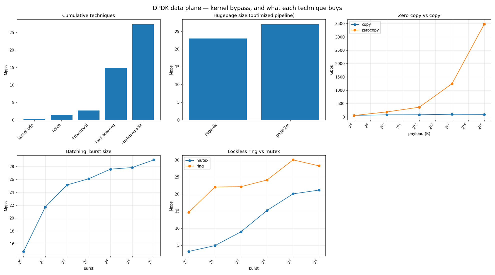

# dpdk-dataplane

**How to process packets ~30× faster than the kernel.**

The kernel does a syscall and a copy per packet. [DPDK](https://www.dpdk.org "Data Plane Development Kit — userspace poll-mode packet processing")
bypasses that with a userspace poll-mode driver, zero-copy buffers, hugepages,
lockless rings, batching, and pinned cores. This repo builds the same pipeline
three ways — kernel sockets, naive userspace, and DPDK with each technique
toggled — and benchmarks them.

## Results



One run of `sudo ./scripts/run_all.sh` produces the chart above:

- **Cumulative techniques** — start from the OS default (`kernel-udp`) and a
  naive userspace pipeline, then add one technique at a time. Each rung is a real
  jump; kernel-bypass + lockless ring + batching together give the headline ~30×.
- **Batching** — throughput vs burst size; handling 32 packets per trip through
  the loop amortizes the fixed per-packet overhead. Rises, then plateaus.
- **Lockless ring vs mutex** — the mutex hurts most at burst 1 (a lock per
  packet); the gap shrinks as batching amortizes it.
- **Optimal config per payload** — per-packet time vs payload size, with one line
  for each **page size × copy-mode** (`4k`/`2m` × copy/zero-copy). **For any data
  size, the lowest line is the best config.** At small payloads a copy is free and
  page size dominates (fewer [TLB](https://en.wikipedia.org/wiki/Translation_lookaside_buffer "Translation Lookaside Buffer — a cache of virtual→physical address lookups. Bigger pages cover more memory per entry, so fewer misses.")
  misses with 2 MB pages); at large payloads the copy buffer is what's expensive,
  so zero-copy pulls far ahead. (Payload tops at 64 KB — an mbuf's data room is a
  16-bit field, so 1 MB packets aren't possible.)

In plain terms: most of the speedup comes from **not going through the kernel for
every packet** and **not paying overhead per packet** (the lockless ring and
batching). Zero-copy and bigger hugepages help too, but only when conditions are
right — zero-copy when packets are large, hugepages when the data set is big — so
the last panel lets you pick the best config for whatever data size you have.

> [!NOTE]
> Cumulative ablation is order-dependent: whichever technique removes the current
> bottleneck gets the biggest rung. The ladder shows contribution, not a fixed ranking.

## Reproduce

```bash
./scripts/setup.sh                  # install DPDK + tools (WSL2 is fine)
sudo ./scripts/hugepages.sh 2m 1024 # reserve 2 GB of 2 MB hugepages
make
sudo ./scripts/run_all.sh           # all sweeps -> results/dpdk_all.png
```

> [!NOTE]
> 4 KB and 2 MB pages work directly in WSL2. **1 GB** pages need a boot-time
> reservation — add `kernelCommandLine = default_hugepagesz=1G hugepagesz=1G hugepages=4`
> under `[wsl2]` in `.wslconfig`, then `wsl --shutdown`. The 1 GB bar is skipped
> if unavailable.

## How it's built

`src/dpdk_pipeline.c` is a producer [lcore](https://doc.dpdk.org/guides/prog_guide/env_abstraction_layer.html "logical core — a DPDK worker thread pinned to one CPU core")
→ queue → consumer lcore. Every technique is a flag, so it can be turned off to
isolate its effect:

- `--size N` — packet / copy-buffer size in bytes (up to ~64 KB)
- `--burst N` — batch size (`1` = no batching)
- `--copy` — `memcpy` the payload (vs zero-copy, processed in place)
- `--malloc` — `malloc`/`free` per packet (vs reusing `rte_mempool` mbufs)
- `--locked-queue` — `std::mutex` + queue (vs lockless `rte_ring`)
- `--no-pin` — run the producer/consumer as floating OS threads instead of
  pinned DPDK lcores. Poll-mode threads that the scheduler can migrate or
  co-schedule onto one core collapse, so this shows why pinning is required.
- **page size is an [EAL](https://doc.dpdk.org/guides/prog_guide/env_abstraction_layer.html "Environment Abstraction Layer — DPDK's startup layer that sets up hugepages, cores, and devices")
  choice, not an app flag** — the runner passes `--no-huge` (4 KB), or
  `--huge-dir <2M|1G mount>` for 2 MB / 1 GB hugepages.

`src/udp_bench.c` is the kernel UDP-loopback baseline (no DPDK).

The sweeps are tunable via env vars: `SIZE`/`SIZES` (packet & zero-copy sizes),
`BURSTS` (batching), `PAGES` (hugepage sizes), `REPS`, `PKTS`.
